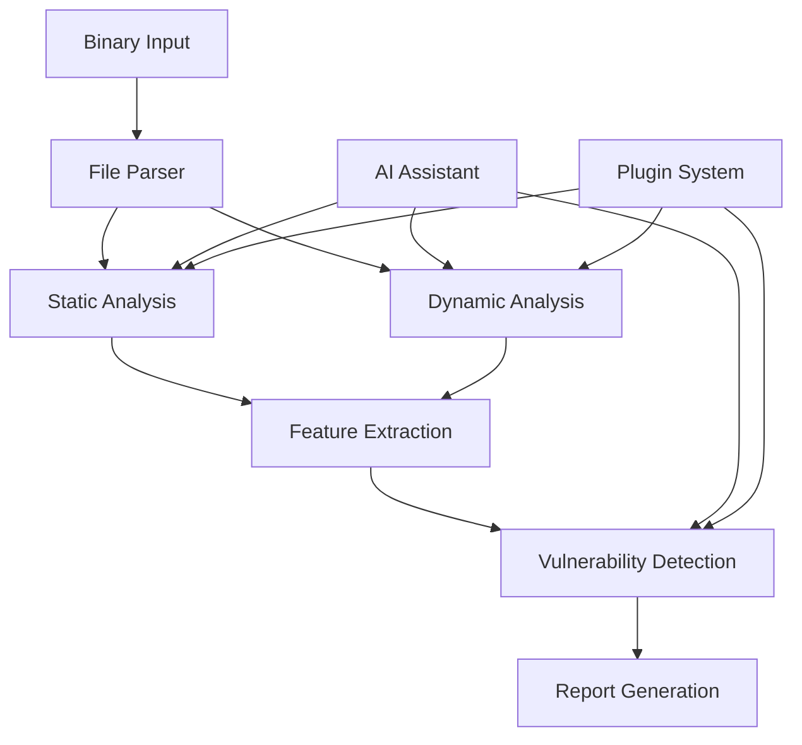

# Intellicrack Architecture Overview

## Introduction

Intellicrack is a comprehensive binary analysis and security research framework designed with modularity, extensibility, and performance in mind. This document provides an architectural overview of the system.

## System Architecture

### Core Components

```
intellicrack/
├── ai/                 # AI/ML integration layer
├── core/              # Core analysis engines
│   ├── analysis/      # Binary analysis modules
│   ├── anti_analysis/ # Anti-analysis detection
│   ├── c2/           # Command & Control infrastructure
│   ├── exploitation/ # Exploitation modules
│   ├── network/      # Network analysis
│   ├── patching/     # Binary patching
│   ├── processing/   # Distributed processing
│   └── reporting/    # Report generation
├── hexview/          # Professional hex editor
├── plugins/          # Plugin system
├── ui/               # User interface
└── utils/            # Utility modules
```

### Design Principles

1. **Modularity**: Each component is self-contained with well-defined interfaces
2. **Extensibility**: Plugin system allows for custom functionality
3. **Performance**: GPU acceleration and distributed processing support
4. **Flexibility**: Multiple analysis engines with graceful fallbacks
5. **Security**: Sandboxed execution environments for untrusted code

## Core Analysis Pipeline

### 1. Binary Loading
```python
Binary File → PE/ELF/Mach-O Parser → Internal Representation
```

### 2. Static Analysis
- Disassembly (Radare2, Capstone)
- Control Flow Graph generation
- String extraction
- Import/Export analysis
- Signature matching

### 3. Dynamic Analysis
- Emulation (QEMU, Qiling, Unicorn)
- Debugging (Frida, native debuggers)
- API monitoring
- Behavior analysis

### 4. Vulnerability Detection
- Pattern matching
- Symbolic execution (angr)
- Taint analysis
- ML-based prediction

## Key Subsystems

### AI Integration Layer

The AI subsystem provides:
- Multiple LLM backend support (OpenAI, Anthropic, Local models)
- Vulnerability prediction using trained ML models
- Code generation and analysis assistance
- Natural language interface for complex queries

### Network Analysis

Network capabilities include:
- Traffic capture and analysis
- Protocol fingerprinting
- License server emulation
- SSL/TLS interception
- Cloud license bypass

### Distributed Processing

For large-scale analysis:
- Ray framework for distributed computing
- Dask for parallel data processing
- GPU acceleration with CUDA/OpenCL
- Container-based isolation

### Plugin System

Extensibility through:
- Custom Python modules
- Hot-reload capability
- Sandboxed execution
- Standardized API

## Data Flow



## Security Considerations

### Sandboxing
- Process isolation for untrusted binaries
- Resource limits (CPU, memory, disk)
- Network isolation options

### Anti-Analysis Detection
- VM detection bypass
- Debugger detection evasion
- Timing attack mitigation

### Data Protection
- Encrypted storage for sensitive data
- Secure communication channels
- API key management

## Performance Optimization

### Memory Management
- Lazy loading for large files
- Memory-mapped file support
- Efficient data structures

### Parallel Processing
- Multi-threading for CPU-bound tasks
- GPU acceleration for pattern matching
- Distributed analysis for large datasets

### Caching
- Result caching with Redis
- Incremental analysis support
- Smart cache invalidation

## Integration Points

### External Tools
- Radare2 for disassembly
- Ghidra for decompilation
- Frida for dynamic instrumentation
- YARA for pattern matching

### APIs
- RESTful API for remote access
- WebSocket for real-time updates
- Plugin API for extensions

### File Formats
- PE, ELF, Mach-O binary formats
- Various archive formats
- Custom protocol definitions

## Future Architecture Goals

1. **Microservices**: Decompose into smaller services
2. **Cloud Native**: Kubernetes deployment support
3. **Real-time Analysis**: Stream processing capabilities
4. **Enhanced ML**: Advanced vulnerability prediction
5. **Cross-platform**: Better mobile platform support
